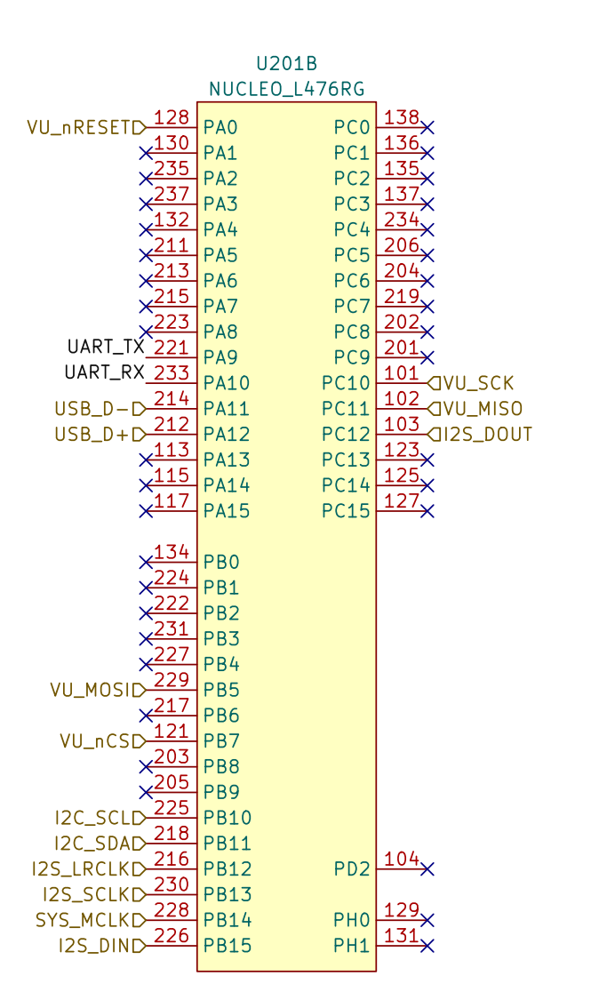
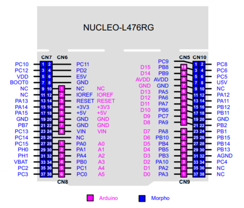

# TP_microControleurs_ANOT_BEAUV

### Voici le rapport du TP Systèmes à microcontrôleurs 


## Fait par :

| Claire ANOT-DELCOURT  | claire.anot-delcourt@ensea.fr  | Antoine BEAUVARLET    | antoine.beauvarlet@ensea.fr    |
| --------------------- | ------------------------------ | --------------------- | ------------------------------ |

## Encadré par :

| Nicolas PAPAZOGLOU    | nicolas.papazoglou@ensea.fr    |
| --------------------- | ------------------------------ |

# 1 Démarrage
1. Créez un projet pour la carte NUCLEO_L476RG. Initialisez les périphériques
avec leur mode par défaut, mais n’activez pas la BSP.


2. Testez la LED LD2.
#
```
int main(void) 
{  
    HAL_Init();
	SystemClock_Config();
	MX_GPIO_Init();

    while (1) {     
        HAL_GPIO_TogglePin(GPIOA, GPIO_PIN_5);  
		HAL_Delay(1000);
    }  
}  
```
3. et 4. Testez l’USART2 connecté à la STLink interne.  Débrouillez-vous pour que la fonction printf fonctionne
```
//Q4 :
int __io_putchar(int chr)
{
	HAL_UART_Transmit(&huart2, (uint8_t *)&chr, 1, HAL_MAX_DELAY);

	return chr;
}

int main(void)
{
//  Reset of all peripherals, Initializes the Flash interface and the Systick.
	HAL_Init();

//  Configure the system clock
	SystemClock_Config();


//  Initialize all configured peripherals
	MX_GPIO_Init();
	MX_USART2_UART_Init();

	while (1)
	{
//  Q3 :
//      HAL_UART_Transmit(&huart2, "Hello world\r\n", 13, 100); 

//  Q4 :
		printf("Hello world\r\n"); 

		HAL_Delay(1000);
		HAL_GPIO_TogglePin(GPIOA, GPIO_PIN_5);
		HAL_Delay(1000);
	}
}


```

# 2 Le GPIO Expander et le VU-Metre
## Configuration
1. Quelle est la référence du GPIO Expander ? Vous aurez besoin de sa datasheet, téléchargez-la.

> référence : MCP23S17

>https://ww1.microchip.com/downloads/aemDocuments/documents/APID/ProductDocuments/DataSheets/MCP23017-Data-Sheet-DS20001952.pdf

2. Sur le STM32, quel SPI est utilisé ?
>   High-Speed SPI Interface (MCP23S17) :
>- 10 MHz (maximum)
>- SPI1, SPI2 ou SPI3
>- En remontant le circuit on arrive a soit SPI1 soit SPI3 
>- Dans Cube IDE SPI1 est bloqué donc c'est `SPI3` qui est utilisé


3. Quels sont les paramètres à configurer dans STM32CubeIDE ?

| Nom | Valeur |
| ------ | ------- |
| Data Size| 8 Bits|
| Clock Polarity | Low|
|Clock Phase| 1 Edge|
|Baud Rate Prescaler | 40Mbit/s|
|First Bit | MSB First|


## Tests

1. Faites clignoter une ou plusieurs LED et Pour toutes les tester, vous pouvez faire un chenillard (par exemple).


## Driver

1. Écrivez un driver pour piloter les LED. Utilisez une structure.

2. Écrivez une fonction shell permettant d’allumer ou d’éteindre n’importe
quelle LED.
```
DriverLED_HandleTypeDef hDriverLed;

HAL_StatusTypeDef DriverLED_Init(DriverLED_HandleTypeDef *hDriverLed, SPI_HandleTypeDef* hspi, GPIO_TypeDef* CS_Port, uint16_t CS_Pin, GPIO_TypeDef* nRST_Port, uint16_t nRST_Pin){
	hDriverLed->hspi = hspi;
	hDriverLed->CS_Port = CS_Port;
	hDriverLed->CS_Pin = CS_Pin;
	hDriverLed->nRST_Port = nRST_Port;
	hDriverLed->nRST_Pin = nRST_Pin;

	HAL_StatusTypeDef return_Status = HAL_OK;

	// Init GPIO Expander
	HAL_GPIO_WritePin(hDriverLed->CS_Port, hDriverLed->CS_Pin, SET);
	HAL_GPIO_WritePin(hDriverLed->nRST_Port, hDriverLed->nRST_Pin, SET);
	HAL_Delay(10);

	DriverLED_WriteRegister(hDriverLed, DIR_GPIOA, 0X00); // DIR A as OUTPUT
	DriverLED_WriteRegister(hDriverLed, DIR_GPIOB, 0X00); // DIR B as OUTPUT

	return return_Status;
}

void DriverLED_WriteRegister(DriverLED_HandleTypeDef *hDriverLed, uint8_t reg, uint8_t data) {
	uint8_t buffer[3];
	buffer[0] = 0x40;  			// Adresse avec bit de commande en écriture
	buffer[1] = reg;            // Registre cible
	buffer[2] = data;           // Donnée à écrire

	HAL_GPIO_WritePin(hDriverLed->CS_Port, hDriverLed->CS_Pin, RESET);
	HAL_SPI_Transmit(hDriverLed->hspi, buffer, 3, HAL_MAX_DELAY);
	HAL_GPIO_WritePin(hDriverLed->CS_Port, hDriverLed->CS_Pin, SET);
}


void DriverLED_WriteLED(DriverLED_HandleTypeDef *hDriverLed, uint16_t value) {
    DriverLED_WriteRegister(hDriverLed, ADDR_GPIOA, (uint8_t)~(value & 0x00FF));
    DriverLED_WriteRegister(hDriverLed, ADDR_GPIOB, (uint8_t)~((value & 0xFF00)>>8));
}
```
Dans le main :
```
while (1) {
        if (uart2_chr == '\r') // Si l'utilisateur appuie sur "Entrée"
	{
		index = 0; // Réinitialise l'index pour la prochaine saisie

		uint16_t value_led = (uint16_t)strtol(buffer, NULL, 16);
		DriverLED_WriteLED(&hDriverLed, value_led);
	}
	else
	{
		buffer[index++] = uart2_chr; // Stocke le caractère
		if (index >= sizeof(buffer) - 1) index = 0; // Évite le dépassement de tableau
	}
}
```
# 3 Le CODEC Audio SGTL5000
## Configuration préalables
Le CODEC a besoin de deux protocoles de communication :
>- L’I2C pour la configuration,
>- L’I2S pour le transfert des échantillons audio.
  
Les configurations suivantes sont à faire sur le logiciel STM32CubeIDE dans la partie graphique CubeMX. Le protocole I2S est géré par le périphérique SAI (Serial Audio Interface).

1. Quelles pins sont utilisées pour l’I2C ? À quel I2C cela correspond dans leSTM32 ?


Broches I2C sur le STM32 NUCLEO-L476RG : 

Le STM32L476RG dispose de plusieurs périphériques I2C (I2C1, I2C2, etc.).
Les broches utilisées pour l'I2C dépendent du périphérique I2C sélectionné.
Typiquement, pour l'I2C1, on retrouve:
>- PB8 : I2C1_SCL (Serial Clock)
>- PB9 : I2C1_SDA (Serial Data)

2. Activez l’I2C correspondant, laissez la configuration par défaut.
   
3. Configurez le SAI2 :
>- SAI A : Master with Master Clock Out,
>- Cochez I2S/PCM protocol,
>- SAI B : Synchronous Slave,
>- Cochez I2S/PCM protocol.
  
4. Si nécessaire, déplacez les signaux sur les bonnes broches. Vous pouvez déplacer une broche avec un [Ctrl+Clic Gauche]. Les signaux du SAI doivent être connectés au broches suivantes :
   
>| Broches | Signaux   | 
>| ----- | ----------- | 
>| PB12  | SAI2_FS_A   |
>| PB13  | SAI2_SCK_A  |
>| PB14  | SAI2_MCLK_A |
>| PB15  | SAI2_SD_A   |
>| PC12  | SAI2_SD_B   |

5. Dans l’onglet Clock Configuration, configurez PLLSAI1 pour obtenir la fréquence To SAI2 à 12.235294 MHz
   
6. Configurez les blocs SAI A et SAI B
7. Activez les interruptions.
8. Configurez le DMA pour le SAI A et le SAI B. Activez le mode circulaire.
9. Avant de passer à la suite, il est nécessaire d’activer l’horloge MCLK pour que le CODEC fonctionne. Pour cela, dans la fonction main(), après les initialisations, ajoutez la ligne suivante :
>__HAL_SAI_ENABLE(&hsai_BlockA2);

Note Sans cette ligne, l’I2C ne fonctionne pas, parce que le CODEC ne
reçoit pas d’horloge !
## 3.2 Configuration du CODEC par l’I2C
1. À l’aide d’un oscilloscope, vérifiez la présence d’une horloge sur le signal MCLK.
   On observe bien un retour sur la broche MCLK
   
2. À l’aide de la fonction HAL_I2C_Mem_Read(), récupérez la valeur du registre CHIP_ID (addresse 0x0000). L’adresse I2C du CODEC est 0x14.
   
3. Observez les trames I2C à l’oscilloscope.
   
4. Montrez à l’enseignant.
   
5. Cherchez dans la documentation du SGTL5000 la valeur à assigner aux registres suivants :
>- CHIP_ANA_POWER
>- CHIP_LINREG_CTRL
>- CHIP_REF_CTRL
>- CHIP_LINE_OUT_CTRL
>- CHIP_SHORT_CTRL
>- CHIP_ANA_CTRL
>- CHIP_ANA_POWER
>- CHIP_DIG_POWER
>- CHIP_LINE_OUT_VOL
>- CHIP_CLK_CTRL
>- CHIP_I2S_CTRL
>- CHIP_ADCDAC_CTRL
>- CHIP_DAC_VOL

>- CHIP_ANA_POWER -> Section de la documentation décrivant le contrôle de l'alimentation analogique. Recherchez les bits permettant d'activer/désactiver les différents blocs analogiques (DAC, ADC, amplis casque, sortie ligne, etc.) et la référence de tension analogique (VAG).
>- CHIP_LINREG_CTRL -> Section traitant du contrôle des régulateurs linéaires internes. Vous y trouverez les bits pour configurer les tensions de sortie des régulateurs (VDDA, VDDIO) en fonction de votre alimentation.
>- CHIP_REF_CTRL -> Section concernant le contrôle de la référence interne. Cherchez les bits pour activer la référence, ajuster le courant de polarisation et potentiellement configurer d'autres aspects de la référence.
>- CHIP_LINE_OUT_CTRL -> Section dédiée au contrôle de la sortie ligne. Vous trouverez ici les bits pour activer/désactiver la sortie ligne, configurer le gain, le mode (single-ended/différentiel) et potentiellement d'autres options.
>- CHIP_SHORT_CTRL -> Section relative au contrôle de la protection contre les courts-circuits. Recherchez les bits pour activer la protection sur les différentes sorties analogiques et potentiellement configurer les seuils.
>- CHIP_ANA_CTRL -> Section traitant du contrôle analogique général. Vous pourriez y trouver des bits pour activer des fonctionnalités comme la détection de passage par zéro pour l'ADC et le DAC, ou d'autres réglages analogiques globaux.
>- CHIP_ANA_POWER -> Répétition du premier registre. Toujours dans la section de la documentation décrivant le contrôle de l'alimentation analogique.
CHIP_DIG_POWER -> Section concernant le contrôle de l'alimentation numérique. Recherchez les bits pour activer/désactiver les différents blocs numériques (interface I2S, etc.).
>- CHIP_LINE_OUT_VOL -> Section traitant du contrôle du volume de la sortie ligne. Vous y trouverez la description du format des 16 bits représentant le niveau de volume pour les canaux gauche et droit.
>- CHIP_CLK_CTRL -> Section dédiée au contrôle de l'horloge. Recherchez les bits pour sélectionner la source de l'horloge (MCLK interne ou externe), configurer le diviseur de fréquence, etc.
>- CHIP_I2S_CTRL -> Section relative au contrôle de l'interface I2S. Vous y trouverez les bits pour configurer le mode (maître/esclave), le format des données (I2S standard, LJ, RJ), la longueur des données (16, 24, 32 bits), etc.
>- CHIP_ADCDAC_CTRL -> Section traitant du contrôle de l'ADC et du DAC. Recherchez les bits pour activer/désactiver l'ADC et le DAC, configurer le taux de suréchantillonnage du DAC, le mode de fonctionnement de l'ADC, etc.
>- CHIP_DAC_VOL -> Section concernant le contrôle du volume du DAC. Vous y trouverez la description du format des 16 bits représentant le niveau de volume pour les canaux gauche et droit du DAC.

1. Créez une paire de fichier sgtl5000.c / sgtl5000.h

2. Dans le fichier sgtl5000.c, créez une fonction d’initialisation.

3. Dans cette fonction, écrivez le code permettant de configurer ces registres.

# Fichier sgtl5000.h
```
#ifndef SGTL5000_H_
#define SGTL5000_H_
#include "stm32l4xx_hal.h"

// Adresses des registres du SGTL5000
#define CHIP_LINREG_CTRL 0x0006
#define CHIP_ANA_POWER 0x0002
#define CHIP_CLK_TOP_CTRL 0x0004
#define CHIP_REF_CTRL 0x000A
#define CHIP_LINE_OUT_CTRL 0x0010
#define CHIP_SHORT_CTRL 0x0014
#define CHIP_ANA_CTRL 0x0016
#define CHIP_DIG_POWER 0x003C
#define CHIP_LINE_OUT_VOL 0x0020
#define CHIP_CLK_CTRL 0x0000
#define CHIP_I2S_CTRL 0x003A
#define CHIP_PLL_CTRL 0x0008
#define CHIP_SSS_CTRL 0x002E

// Fonction d'initialisation
void SGTL5000_Init(SPI_HandleTypeDef *hi2c);

// Fonction d'écriture de registre
HAL_StatusTypeDef SGTL5000_WriteReg(SPI_HandleTypeDef *hi2c, uint8_t reg, uint16_t data);

#endif /* SGTL5000_H_ */
```
# Fichier sgtl5000.c
```
#include "sgtl5000.h"
// Fonction d'écriture de registre
HAL_StatusTypeDef SGTL5000_WriteReg(SPI_HandleTypeDef *hi2c, uint8_t reg, uint16_t data) {
    uint8_t tx_buffer[3];
    tx_buffer[0] = (reg << 1); // Adresse du registre + bit d'écriture (0)
    tx_buffer[1] = (data >> 8) & 0xFF; // Octet de poids fort
    tx_buffer[2] = data & 0xFF; // Octet de poids faible
    return HAL_I2C_Master_Transmit(hi2c, 0x0A << 1, tx_buffer, 3, HAL_MAX_DELAY); // adresse sgtl5000 = 0x0A
}

// Fonction d'initialisation
void SGTL5000_Init(SPI_HandleTypeDef *hi2c) {

    // Configuration de l'alimentation
    SGTL5000_WriteReg(hi2c, CHIP_LINREG_CTRL, 0x0008);
    SGTL5000_WriteReg(hi2c, CHIP_ANA_POWER, 0x7260);
    SGTL5000_WriteReg(hi2c, CHIP_CLK_TOP_CTRL, 0x0800);
    SGTL5000_WriteReg(hi2c, CHIP_ANA_POWER, 0x4A60);
    SGTL5000_WriteReg(hi2c, CHIP_LINREG_CTRL, 0x006C);

    // Tension de référence et configuration du courant de polarisation
    SGTL5000_WriteReg(hi2c, CHIP_REF_CTRL, 0x004E);
    SGTL5000_WriteReg(hi2c, CHIP_LINE_OUT_CTRL, 0x0322);

    // Autres configurations de blocs analogiques
    SGTL5000_WriteReg(hi2c, CHIP_REF_CTRL, 0x004F);
    SGTL5000_WriteReg(hi2c, CHIP_SHORT_CTRL, 0x1106);
    SGTL5000_WriteReg(hi2c, CHIP_ANA_CTRL, 0x0133);
    
	// Mise sous tension des entrées/sorties/blocs numériques
    SGTL5000_WriteReg(hi2c, CHIP_ANA_POWER, 0x6AFF);
    SGTL5000_WriteReg(hi2c, CHIP_DIG_POWER, 0x0073);
    
	// Définir le niveau de volume LINEOUT
    SGTL5000_WriteReg(hi2c, CHIP_LINE_OUT_VOL, 0x0505);
    
	// Horloge Système MCLK et Horloge d'Échantillonnage
    SGTL5000_WriteReg(hi2c, CHIP_CLK_CTRL, 0x0002);
    SGTL5000_WriteReg(hi2c, CHIP_CLK_CTRL, 0x0000);
    SGTL5000_WriteReg(hi2c, CHIP_I2S_CTRL, 0x0001);
    
	// Configuration de la PLL
    SGTL5000_WriteReg(hi2c, CHIP_ANA_POWER, 0x0400);
    SGTL5000_WriteReg(hi2c, CHIP_ANA_POWER, 0x0100);
    SGTL5000_WriteReg(hi2c, CHIP_CLK_TOP_CTRL, 0x0008);
    SGTL5000_WriteReg(hi2c, CHIP_PLL_CTRL, 0x6028);
    SGTL5000_WriteReg(hi2c, CHIP_PLL_CTRL, 0x07D0);
    
	// Routage des Entrées/Sorties
    SGTL5000_WriteReg(hi2c, CHIP_SSS_CTRL, 0x0001);
    SGTL5000_WriteReg(hi2c, CHIP_SSS_CTRL, 0x0003);
    SGTL5000_WriteReg(hi2c, CHIP_ANA_CTRL, 0x0000);
    SGTL5000_WriteReg(hi2c, CHIP_ANA_CTRL, 0x0000);
    SGTL5000_WriteReg(hi2c, CHIP_SSS_CTRL, 0x0000);
    SGTL5000_WriteReg(hi2c, CHIP_ANA_CTRL, 0x0040);
}
```
## 3.3 Signaux I2S
1. Démarrez la réception et la transmission sur l’I2S avec le SAI :
>- HAL_SAI_Receive_DMA();
>- HAL_SAI_Transmit_DMA();

2. Observez à l’oscilloscope les différents signaux d’horloge.

3. Montrez à l’enseignant.

## 3.4 Génération de signal audio
1. Générez un signal triangulaire.

2. Vérifier à l’oscilloscope, montrez à l’enseignant.

## 3.5 Bypass numérique
1. Écrivez le code permettant de lire les échantillons de l’ADC, et de les écrire sur le DAC.

2. Vérifier à l’oscilloscope, montrez à l’enseignant.

# 4 Visualisation
1. Écrivez le code permettant de visualiser le volume sonore sur les LED.
>https://en.wikipedia.org/wiki/VU_meter

2. Montrez à l’enseignant.

# 5 Filtre RC


4. Pour une fréquence d’échantillonnage de 48kHz, combien de cycles processeurs disposons-nous pour traiter chaque échantillon ?
5. Créez une paire de fichiers RCFilter.c / RCFilter.h

6. Créez la structure suivante dans RCFilter.h :
#
typedef struct {  
uint32_t coeff_A;  
uint32_t coeff_B;  
uint32_t coeff_D;  
uint16_t out_prev;  
} h_RC_filter_t;  
#
7. Écrivez les fonctions suivantes :
   
>// Calcule les coefficients A, B et D
>// Et les stocke dans la structure  
void RC_filter_init(h_RC_filter_t * h_RC_filter, uint16_t cutoff_frequency, int16_t sampling_frequency);
>// Implémente l'équation de récurrence
>// Faites attention au type des différentes variables  
uint16_t RC_filter_update(h_RC_filter_t * h_RC_filter, uint16_t input);

8. Ajoutez une fonction au Shell pour modifier la fréquence de coupure.

9. Faites valider par votre enseignant.

# 6 Programmation d’un effet audio

1. Programmez un effet audio de votre choix :
(a) Saturation/distortion  

(b) Tremolo  

(c) Filtre analogique  

(d) Delay (court...)  

(e) Chorus/Phaser/Flanger  

(f) Compresseur  

(g) Reverb  


