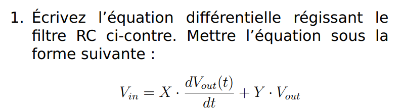
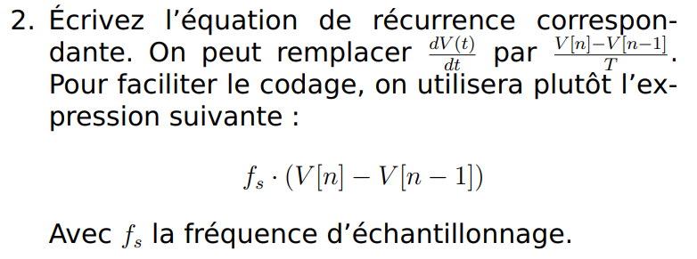
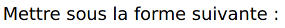
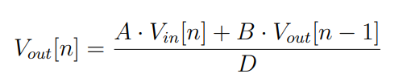
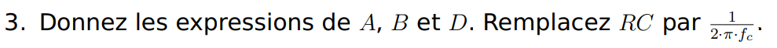

# TP_microControleurs_ANOT_BEAUV

### Voici le rapport du TP Systèmes à microcontrôleurs 


## Fait par :

| Claire ANOT-DELCOURT  | claire.anot-delcourt@ensea.fr  | Antoine BEAUVARLET    | antoine.beauvarlet@ensea.fr    |
| --------------------- | ------------------------------ | --------------------- | ------------------------------ |

## Encadré par :

| Nicolsa PAPAZOGLOU    | nicolas.papazoglou@ensea.fr    |
| --------------------- | ------------------------------ |

# 1 Démarrage
1. Créez un projet pour la carte NUCLEO_L476RG. Initialisez les périphériques
avec leur mode par défaut, mais n’activez pas la BSP.


2. Testez la LED LD2.
#
```
#include "stm32l476xx.h"  
void delay(uint32_t time) 
{
    while(time--); 
}  

int main(void) 
{  

//  Activation de l'horloge du GPIOA   
    RCC->AHB2ENR |= RCC_AHB2ENR_GPIOAEN;  
 
//  Configuration de PA5 en mode sortie  
    GPIOA->MODER &= ~GPIO_MODER_MODE5_1;  
    GPIOA->MODER |= GPIO_MODER_MODE5_0;  
 

    while (1) {     

        HAL_GPIO_TogglePin(GPIOA, GPIO_PIN_5);
		HAL_Delay(1000);
    }  
}  
```
2. Testez l’USART2 connecté à la STLink interne.
```
#include "stm32l476xx.h"
void USART2_Init(void) 
{
//  Activation des horloges de l'USART2 et du GPIOA
    RCC->APB1ENR1 |= RCC_APB1ENR1_USART2EN;
    RCC->AHB2ENR |= RCC_AHB2ENR_GPIOAEN;

//  Configuration de PA2 (TX) et PA3 (RX) en mode alternatif
    GPIOA->MODER &= ~(GPIO_MODER_MODE2_0 | GPIO_MODER_MODE3_0);
    GPIOA->MODER |= (GPIO_MODER_MODE2_1 | GPIO_MODER_MODE3_1);

//  Configuration de la fonction alternative pour PA2 et PA3 (AF7 pour USART2)
    GPIOA->AFR[0] |= (7 << GPIO_AFRL_AFSEL2_Pos) | (7 << GPIO_AFRL_AFSEL3_Pos);
    
//  Configuration de l'USART2 (9600 bauds, 8 bits, pas de parité, 1 stop bit)
    USART2->BRR = 80000000/9600;//pour une frequence de 80Mhz
    USART2->CR1 |= USART_CR1_TE | USART_CR1_RE; // Activation de l'émetteur et du récepteur
    USART2->CR1 |= USART_CR1_UE; // Activation de l'USART2
}

void USART2_Transmit(char c) 
{
    while (!(USART2->ISR & USART_ISR_TXE)); 

//  Attendre que le tampon d'émission soit vide
    USART2->TDR = c;
}

char USART2_Receive(void) 
{
    while (!(USART2->ISR & USART_ISR_RXNE)); 

//  Attendre qu'un caractère soit reçu
    return USART2->RDR;
}

int main(void) {
    USART2_Init();
    while (1) 
    {
        char receivedChar = USART2_Receive();
//      Echo du caractère reçu
        USART2_Transmit(receivedChar); 
    }
}
```
3. Débrouillez-vous pour que la fonction printf fonctionne


# 2 Le GPIO Expander et le VU-Metre
## Configuration
1. Quelle est la référence du GPIO Expander ? Vous aurez besoin de sa datasheet, téléchargez-la.

>https://ww1.microchip.com/downloads/aemDocuments/documents/APID/ProductDocuments/DataSheets/MCP23017-Data-Sheet-DS20001952.pdf

2. Sur le STM32, quel SPI est utilisé ?
   
3. Quels sont les paramètres à configurer dans STM32CubeIDE ?
   
4. Configurez-les.

## Tests
1. Faites clignoter une ou plusieurs LED.
   
2. Pour toutes les tester, vous pouvez faire un chenillard (par exemple).

## Driver
1. Écrivez un driver pour piloter les LED. Utilisez une structure.

2. Écrivez une fonction shell permettant d’allumer ou d’éteindre n’importe
quelle LED.

# 3 Le CODEC Audio SGTL5000
## Configuration préalables
Le CODEC a besoin de deux protocoles de communication :
>- L’I2C pour la configuration,
>- L’I2S pour le transfert des échantillons audio.
  
Les configurations suivantes sont à faire sur le logiciel STM32CubeIDE dans la partie graphique CubeMX. Le protocole I2S est géré par le périphérique SAI (Serial Audio Interface).

1. Quelles pins sont utilisées pour l’I2C ? À quel I2C cela correspond dans leSTM32 ?

2. Activez l’I2C correspondant, laissez la configuration par défaut.
   
3. Configurez le SAI2 :
>- SAI A : Master with Master Clock Out,
>- Cochez I2S/PCM protocol,
>- SAI B : Synchronous Slave,
>- Cochez I2S/PCM protocol.
  
4. Si nécessaire, déplacez les signaux sur les bonnes broches. Vous pouvez déplacer une broche avec un [Ctrl+Clic Gauche]. Les signaux du SAI doivent être connectés au broches suivantes :
   
>| Broches | Signaux   | 
>| ----- | ----------- | 
>| PB12  | SAI2_FS_A   |
>| PB13  | SAI2_SCK_A  |
>| PB14  | SAI2_MCLK_A |
>| PB15  | SAI2_SD_A   |
>| PC12  | SAI2_SD_B   |

5. Dans l’onglet Clock Configuration, configurez PLLSAI1 pour obtenir la fréquence To SAI2 à 12.235294 MHz
   
6. Configurez les blocs SAI A et SAI B
7. Activez les interruptions.
8. Configurez le DMA pour le SAI A et le SAI B. Activez le mode circulaire.
9. Avant de passer à la suite, il est nécessaire d’activer l’horloge MCLK pour que le CODEC fonctionne. Pour cela, dans la fonction main(), après les initialisations, ajoutez la ligne suivante :
>__HAL_SAI_ENABLE(&hsai_BlockA2);

Note Sans cette ligne, l’I2C ne fonctionne pas, parce que le CODEC ne
reçoit pas d’horloge !
## 3.2 Configuration du CODEC par l’I2C
1. À l’aide d’un oscilloscope, vérifiez la présence d’une horloge sur le signal MCLK.
   
2. À l’aide de la fonction HAL_I2C_Mem_Read(), récupérez la valeur du registre CHIP_ID (addresse 0x0000). L’adresse I2C du CODEC est 0x14.
   
3. Observez les trames I2C à l’oscilloscope.
   
4. Montrez à l’enseignant.
   
5. Cherchez dans la documentation du SGTL5000 la valeur à assigner aux registres suivants :
>- CHIP_ANA_POWER
>- CHIP_LINREG_CTRL
>- CHIP_REF_CTRL
>- CHIP_LINE_OUT_CTRL
>- CHIP_SHORT_CTRL
>- CHIP_ANA_CTRL
>- CHIP_ANA_POWER
>- CHIP_DIG_POWER
>- CHIP_LINE_OUT_VOL
>- CHIP_CLK_CTRL
>- CHIP_I2S_CTRL
>- CHIP_ADCDAC_CTRL
>- CHIP_DAC_VOL

6. Créez une paire de fichier sgtl5000.c / sgtl5000.h

7. Dans le fichier sgtl5000.c, créez une fonction d’initialisation.

8. Dans cette fonction, écrivez le code permettant de configurer ces registres.
   
## 3.3 Signaux I2S
1. Démarrez la réception et la transmission sur l’I2S avec le SAI :
>- HAL_SAI_Receive_DMA()
>- HAL_SAI_Transmit_DMA()

2. Observez à l’oscilloscope les différents signaux d’horloge.

3. Montrez à l’enseignant.

## 3.4 Génération de signal audio
1. Générez un signal triangulaire.

2. Vérifier à l’oscilloscope, montrez à l’enseignant.

## 3.5 Bypass numérique
1. Écrivez le code permettant de lire les échantillons de l’ADC, et de les écrire sur le DAC.

2. Vérifier à l’oscilloscope, montrez à l’enseignant.

# 4 Visualisation
1. Écrivez le code permettant de visualiser le volume sonore sur les LED.
>https://en.wikipedia.org/wiki/VU_meter

2. Montrez à l’enseignant.

# 5 Filtre RC










4. Pour une fréquence d’échantillonnage de 48kHz, combien de cycles processeurs disposons-nous pour traiter chaque échantillon ?
5. Créez une paire de fichiers RCFilter.c / RCFilter.h

6. Créez la structure suivante dans RCFilter.h :
#
typedef struct {  
uint32_t coeff_A;  
uint32_t coeff_B;  
uint32_t coeff_D;  
uint16_t out_prev;  
} h_RC_filter_t;  
#
7. Écrivez les fonctions suivantes :
   
>// Calcule les coefficients A, B et D
>// Et les stocke dans la structure  
void RC_filter_init(h_RC_filter_t * h_RC_filter, uint16_t cutoff_frequency, int16_t sampling_frequency);
>// Implémente l'équation de récurrence
>// Faites attention au type des différentes variables  
uint16_t RC_filter_update(h_RC_filter_t * h_RC_filter, uint16_t input);

8. Ajoutez une fonction au Shell pour modifier la fréquence de coupure.

9. Faites valider par votre enseignant.

# 6 Programmation d’un effet audio

1. Programmez un effet audio de votre choix :
(a) Saturation/distortion  

(b) Tremolo  

(c) Filtre analogique  

(d) Delay (court...)  

(e) Chorus/Phaser/Flanger  

(f) Compresseur  

(g) Reverb  


